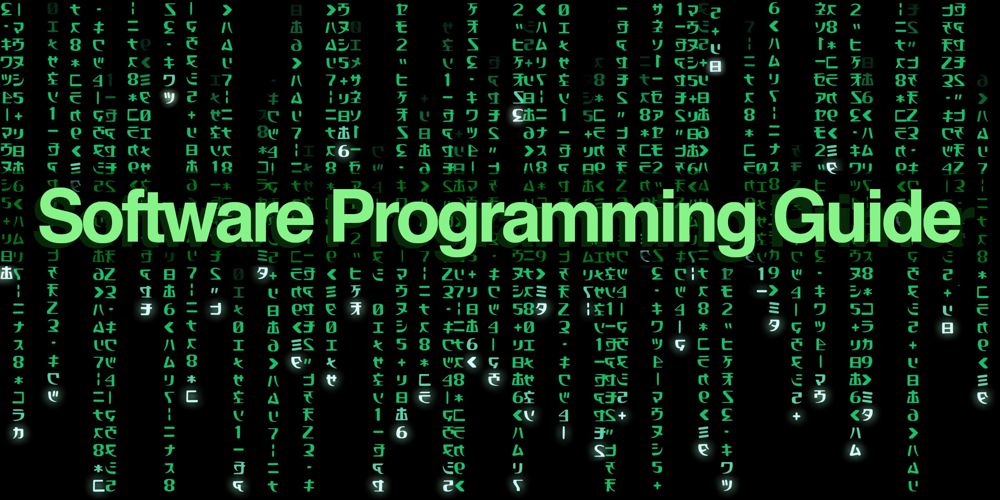

# Software Programming Primer

Software Programming Primer: Concepts, Tactics, Ideas.

This is a glossary guide e-book, with one topic per page. 

* Download the [free e-book](software-programming-primer.pdf).
* If you wish, [pay what you want](https://gumroad.com/l/software-programming-primer).
* Edited by [Joel Parker Henderson](https://github.com/joelparkerhenderson).
* For questions and suggestions [email me](mailto:joel@joelparkerhenderson.com).

## Contents

Introduction

  * What is this book?
  * Who is this for?
  * Why am I creating this?
  * Are there other primers?

Programming paradigms

  * Functional Programming
  * Procedural Programming
  * Imperative Programming
  * Declarative Programming
  * Object-Oriented Programming (OOP)
  * Aspect-Oriented Programming (AOP)
  * Message-Oriented Programming (MOP)
  * Event-Driven Programming (EDP)
  * Logic Programming
  * Actor Programming

Software design approaches

  * Level-Oriented Design (LOD)
  * Data Flow-Oriented Design (DFD)
  * Data Structure-Oriented Design (DSD)
  * Object-Oriented Design (OOD)

Algorithms

  * Sort algorithms
  * Search algorithms
  * Graph algorithms
  * Dynamic programming algorithms
  * Constraint satisfaction algorithms
  * Consensus algorithms
  * MapReduce
  * Sieve of Eratosthenes

Data

Database paradigms

  * Relational database
  * Document database
  * Object database
  * Graph database
  * Vector database
  * Ledger database
  * Time-series database

Database availability

  * Database sharding
  * Database replication
  * Replica database
  * Distributed database
  * Eventually-consistent database
  * CAP theorem
  * PACELC theorem
  * Lamport timestamp
  * Vector clock
  * Data-at-rest
  * Data-in-motion

Data structures

  * Array data structure
  * Graph data structure
  * Tree data structure
  * Tagged union
  * Bloom filter
  * Kalman filter

Data tactics

  * Data schema
  * Data warehouse
  * Data lake
  * Data mesh
  * Extract, Transform, Load (ETL)
  * Batch processing

Design patterns

  * Backpressure
  * Circuit breaker
  * Dependency injection (DI)
  * Inversion of Control (IoC)

Distributed ledger

  * Blockchain
  * Bitcoin
  * Ethereum
  * Smart contract
  * Proof-of-work (PoW)
  * Proof-of-stake (PoS)
  * Practical Byzantine Fault Tolerance (PBFT)

Technology tactics

  * Constraint satisfaction
  * Network protocols
  * State machine
  * Coordinated disclosure
  * Responsible disclosure: see coordinated disclosure
  * Compression
  * Caching
  * Russian-doll caching - TODO
  * Cryptography
  * Encoding
  * Encryption
  * Homomorphic encryption
  * Inheritance - TODO
  * Composition - TODO
  * Recursion
  * Federation
  * Memoization
  * Serialization
  * Message queue
  * Tuple space
  * Checked exceptions
  * Queueing theory
  * Software Development Kit (SDK)
  * Software Development Kit (SDK) - benefits
  * Application Programming Interface (API)
  * Application Programming Interface (API) - benefits
  * Text-To-Speech (TTS) and Speech-To-Text (STT)
  * Universally Unique Identifier (UUID)

Runtime - TODO

  * Memory management - TODO
  * Garbage collection - TODO
  * Asynchronous processing (asynchronicity)
  * Parallel processing (parallelism)
  * Concurrent processing (concurrency)

Software architecture

  * Monolith architecture - TODO
  * Microservice architecture - TODO
  * Service-oriented architecture (SOA)
  * Event-Driven Architecture (EDA)
  * Representational State Transfer (REST)
  * Simple Object Access Protocol (SOAP)
  * Remote procedure call (RPC)

Software development methodologies

  * Waterfall software development methodology
  * Agile software development methodology
  * Rapid Application Development (RAD)
  * Extreme Programming (XP)

Software testing

  * Unit testing
  * Integration testing
  * End-to-end testing
  * System testing
  * Regression testing
  * Acceptance testing
  * Usability testing
  * Accessibility testing
  * Localization testing
  * Performance testing
  * Benchmark testing
  * Security testing
  * Fuzz testing - TODO
  * Penetration testing
  * Shift-left testing
  * Bug bounty

Version control

  * Commit
  * Topic branch
  * Pull request
  * Gitflow
  * Trunk-based development

DevOps

  * Continuous delivery (CD)
  * Continuous deployment (CD)
  * Continuous integration (CI)
  * DORA metrics
  * Mean Time To Repair (MTTR)

Security

Security attacks

  * Social engineering
  * Piggyback attack
  * Phishing
  * Spear phishing
  * Malware
  * Ransomware
  * SQL injection
  * Security by obscurity

Security mitigations

  * Defense in depth
  * Perfect Forward Secrecy (PFS)
  * Intrusion Detection System (IDS)
  * Security Information and Event Management (SIEM)
  * Transport Layer Security (TLS)
  * Secure Sockets Layer (SSL)
  * Digital certificate
  * Certificate Authority (CA)

Project management methodologies

  * Scope
  * Statement Of Work (SOW)
  * Functional specifications
  * Software development life cycle (SDLC)
  * Project estimation
  * Critical chain project management
  * Lean software development methodology
  * Agile software development methodology
  * Kanban
  * Scrum
  * Prince2

Design Development

  * Big design up front (BDUF)
  * Domain-Driven Design (DDD)
  * Behavior-Driven Development (BDD)
  * Test-Driven Development (TDD)

Markup language

  * Hypertext Markup Language (HTML)
  * Extensible Markup Language (XML)
  * Tom's Opinionated Markup Language (TOML)
  * YAML Ain't Markup Language (YAML)
  * Financial Products Markup Language (FPML)
  * Geography Markup Language (GML)
  * Strategy Markup Language (StratML)

Query language

  * Structured Query Language (SQL)
  * Graph Query Language (GraphQL)
  * SPARQL Protocol and RDF Query Language (SPARQL)

Modeling language

  * Domain-Specific Language (DSL)
  * Unified Modeling Language (UML)
  * Schema.org
  * Resource Description Framework (RDF)
  * Web Ontology Language (OWL)
  * The Semantic Web

Modeling diagrams

  * Activity diagram
  * Sequence diagram
  * Use case diagram
  * Object diagram
  * Class diagram
  * Package diagram
  * Component diagram
  * Deployment diagram
  * State diagram
  * Timing diagram
  * Entity-relationship diagram (ERD)
  * Cause-and-effect diagram
  * Fishbone diagram: see cause-and-effect diagram
  * Ishikawa diagram: see cause-and-effect diagram
  * PlantUML
  * Mermaid.js

Teams

Teamwork

  * Forming, Storming, Norming, Performing (FSNP)
  * Icebreaker questions
  * Pizza team
  * Squad team
  * Community of Practice (CoP)
  * The Spotify Model
  * Ways Of Working (WOW)
  * TEAM FOCUS
  * Pair programming

Larger Projects

Digital transformation

  * Business information systems
  * Line-of-business (LOB) application
  * Front-office applications
  * Back-office applications

Change management

  * Business continuity
  * Operational resilience
  * Standard Operating Procedure (SOP)
  * Playbook
  * Runbook

Quality control

  * Program Evaluation and Review Technique (PERT)
  * After-Action Report (AAR)
  * Blameless retrospective
  * Issue tracker
  * Cynefin framework
  * Five Whys analysis
  * Non-functional requirements: see system quality attributes
  * Root cause analysis (RCA)
  * System Quality Attributes (SQAs)
  * Quality of Service (QoS) for networks
  * Good Enough For Now (GEFN)
  * Technical debt
  * Refactoring
  * See also: cause and effect diagram

Statistical analysis

  * Descriptive statistics
  * Inferential statistics
  * Correlation
  * Causation
  * Probability
  * Variance
  * Trend analysis
  * Anomaly detection
  * Quantitative fallacy
  * Regression to the mean
  * Bayes' theorem
  * Chi-square analysis
  * Monte Carlo methods
  * Statistical analysis techniques

Artificial intelligence (AI)

  * Machine learning (ML)
  * Case-based reasoning (CBR)
  * Natural Language Processing (NLP)
  * Expert system
  * AI for software programming
  * AI content generator
  * AI image generation
  * AI internationalization/localization

Lore

Computer science thought problems

  * Hello World - TODO
  * Fizz Buzz - TODO
  * Knapsack problem
  * Tower of Hanoi problem
  * Dining Philosophers problem
  * Traveling Salesman problem
  * N-queens problem
  * Byzantine Generals problem
  * Longest Common Subsequence problem - TODO
  * Edit Distance problem - TODO

Books about software programming

  * “The Phoenix Project” by Gene Kim et al.
  * “The Mythical Man-Month” by Fred Brooks

Software programming quotations

  * Premature optimization is the root of all evil
  * There are only two hard things in computer science
  * One person's constant is another person's variable

Aphorisms

  * Brooks' Law
  * Conway's Law
  * Gresham’s Law
  * Hyrum’s Law
  * Metcalfe's Law
  * Moore's Law
  * The Law of Demos (Kapor's Law)
  * The Law of Supply and Demand
  * The Law of Conservation of Complexity (Tesler's Law)
  * The Law of Large Numbers
  * The Pareto Principle (The 80/20 Rule)
  * The Principle of Least Knowledge (The Law of Demeter)
  * Chesterton's fence
  * The Tragedy of the Commons
  * For more see our Business Lingo Primer

Idioms

  * Architecture astronaut
  * Convention over configuration - TODO
  * Rubber duck debugger
  * White hat versus black hat hacker
  * For more see our Business Lingo Primer

Soft skills

  * How to name functions
  * How to organize code
  * How to refactor code
  * How to ask for help
  * How to collaborate
  * How to get feedback
  * How to give feedback

TODO

  * Just In Time (JIT) - TODO
  * Thread - TODO
  * Virtual machine - TODO
  * Green thread - TODO
  * N+1 problem - TODO
  * Complexify - TODO
  * Environment variable - TODO
  * Naming convention - TODO
  * Dotfile - TODO
  * pair programming - TODO
  * DSL - TODO

Conclusion

  * About the editor
  * About the AI
  * About the ebook
  * About related projects

## All our primers

* [Innovation Partnership Primer](https://github.com/sixarm/innovation-partnership-primer)

* [Startup Business Primer](https://github.com/sixarm/startup-business-primer)

* [Business Lingo Primer](https://github.com/sixarm/business-lingo-primer)

* [Software Programming Primer](https://github.com/sixarm/software-programming-primer)

* [UI/UX Design Primer](https://github.com/sixarm/ui-ux-design-primer)

* [Software Programming Primer](https://github.com/sixarm/software-programming-primer)
